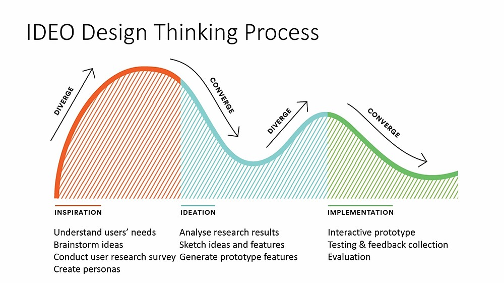

# Design

## The 6 Levels of UX Maturity]
See [The 6 Levels of UX Maturity](levels-ux-maturity.md)

## User-centered design

See [User-centered design (UCD) or user-driven development (UDD)](human-centered-design.md)

_References:_
_https://www.interaction-design.org/literature_

 
From: https://www.interaction-design.org/literature/topics/user-centered-design"

## Double Diamond model

https://handbook.gitlab.com/handbook/product/ux/ux-research/when-to-conduct-ux-research/

1. Design the right thing. 
2. Design things right.

https://en.wikipedia.org/wiki/Double_Diamond_(design_process_model)

Based on the Double Diamond - Design council:

## IDEO Design Thinking

https://designthinking.ideo.com/

The three core activities of Design Thinking

